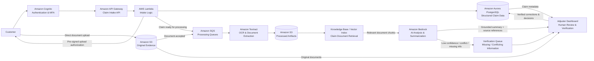

# ClaimGuard AI — AWS Architecture Diagram

## Enterprise Insurance Claims Intelligence & Automation Platform

```mermaid
flowchart LR

    Customer[Customer]
    Cognito[Amazon Cognito<br/>Authentication & MFA]
    API[Amazon API Gateway<br/>Claim Intake API]
    Lambda[AWS Lambda<br/>Intake Logic]

    Aurora[(Amazon Aurora PostgreSQL<br/>Structured Claim Data)]
    S3Original[(Amazon S3<br/>Original Evidence)]

    Customer --> Cognito
    Cognito --> API
    API --> Lambda

    Lambda --> Aurora
    Lambda -->|Pre-signed upload authorization| Customer
    Customer -->|Direct document upload| S3Original
    SQS[Amazon SQS<br/>Processing Queues]
    Textract[Amazon Textract<br/>OCR & Document Extraction]
    Processed[(Amazon S3<br/>Processed Artifacts)]

    S3Original -->|Document accepted| SQS
    Lambda -->|Claim ready for processing| SQS
    SQS --> Textract
    Textract --> Processed
    Bedrock[Amazon Bedrock<br/>AI Analysis & Summarization]
    Knowledge[Knowledge Base / Vector Index<br/>Claim Document Retrieval]
    Adjuster[Adjuster Dashboard<br/>Human Review & Verification]
    Review[Verification Queue<br/>Missing / Conflicting Information]

    Processed --> Knowledge
    Knowledge -->|Relevant document chunks| Bedrock
    Bedrock -->|Grounded summary + source references| Adjuster

    Aurora -->|Claim metadata| Adjuster
    S3Original -->|Original documents| Adjuster

    Bedrock -->|Low confidence / conflict / missing info| Review
    Review --> Adjuster
    Adjuster -->|Verified corrections & decisions| Aurora
```
